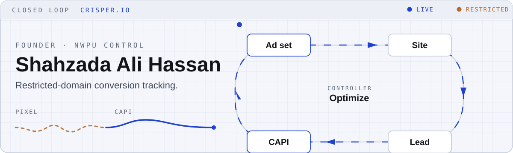

<picture>
  <source media="(prefers-color-scheme: dark)" srcset="assets/closed-loop-dark.svg">
  
</picture>

I build **[Crisper](https://crisper.io)**: server-side conversion tracking that puts Lead and Schedule back on the **same restricted domain**. No redirect landing page. No pixel reset. The plant still converts; the optimizer just couldn't see it.

Control sciences is the other half of that sentence. Measure the output, close the loop, keep the actuator honest.

**Crisper.io** — product. Agencies running Meta for health & wellness clinics whose Events Manager went quiet.  
**Tracking Academy** — implementation. sGTM, Meta CAPI, GA4, and making pixel + server events match once.  
**NWPU, Xi'an** — Control Sciences & Engineering. The degree and the tracking job are the same diagram.

### How the loop closes

1. **Domain is restricted.** Meta strips or blocks standard events. CRM still gets leads. Ad sets starve.
2. **First-party sGTM.** Same host, server container, hashed user data, `event_id` dedup.
3. **Lead / Schedule return.** Events Manager can optimize again.

### In this org

- [crisper.io](https://github.com/HassanAMZ/crisper.io) — the product (Next.js, Convex, Clerk, Stripe)
- [shopify-datalayer](https://github.com/HassanAMZ/shopify-datalayer) — commerce events that survive the theme editor
- [shopify-cross-domain-tracking](https://github.com/HassanAMZ/shopify-cross-domain-tracking) — identity across checkout hops
- [Model-Predictive-Control-Process-Control-Method](https://github.com/HassanAMZ/Model-Predictive-Control-Process-Control-Method) — the academic original of the diagram above

### Elsewhere

[Crisper](https://crisper.io) · [Tracking Academy](https://trackingacademy.com) · [Upwork](https://www.upwork.com/freelancers/~015b35831b56606433) · [YouTube](https://www.youtube.com/channel/UC8tapbraiwvk5nnQW0Eqh9g) · [LinkedIn](https://www.linkedin.com/in/shahzadaalihassan) · [X](https://x.com/shahzada_A)
